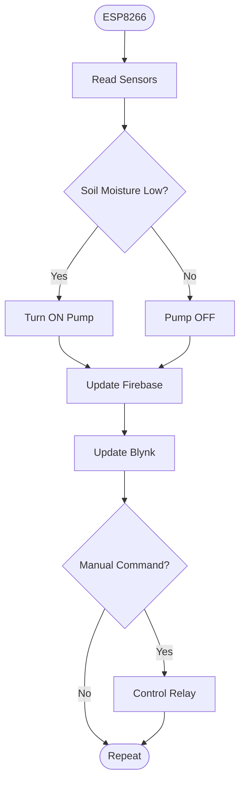

# Solar-Powered-Smart-Irrigation-System
An ESP8266-based solar-powered smart irrigation system with real-time environmental monitoring, Firebase integration, and automatic irrigation control.


> An ESP8266-based solar-powered smart irrigation system featuring automatic watering, environmental monitoring, Firebase cloud storage, and remote control through the Blynk IoT mobile application.


# Table of Contents
1. Introduction
2. Features
3. Hardware
4. Software
5. Getting Started
6. Results
7. Future Work
8. Contact
9. License

# 1. Introduction

This project presents a solar-powered smart irrigation system designed to automatically monitor environmental conditions and irrigate plants only when necessary.

The system is built around the ESP8266 microcontroller and integrates multiple sensors including soil moisture, temperature, humidity, light intensity, and CO₂ concentration. Sensor data are uploaded to Firebase Realtime Database while users can remotely monitor and manually control the irrigation process through the Blynk IoT mobile application.

The primary objective of this project is to reduce water consumption, enable renewable-energy-powered agriculture, and provide a low-cost IoT solution suitable for home gardens and small-scale farming.
# 2. Features

🌞 Solar Powered
- Operates entirely from a photovoltaic charging system with rechargeable Li-ion batteries.

💧 Automatic Irrigation
- Automatically activates the water pump based on soil moisture conditions.

📱 Remote Monitoring
- Monitor environmental parameters and manually control the irrigation system using the Blynk IoT mobile application.

☁️ Cloud Data Logging
- Uploads sensor data to Firebase Realtime Database for cloud storage.

🌡️ Environmental Monitoring
- Measures temperature, humidity, light intensity, soil moisture, and CO₂ concentration in real time.

🔋 Battery Monitoring
- Estimates remaining battery voltage using a voltage divider circuit.

🛠️ Open Source
- Complete hardware design, firmware source code, PCB files, and documentation are included.

# 3. Hardware

## 3.1 BOM
| Component | Qty |
| --------- | --- |
| Solar panel 6v 10W | 1 |
| ESP8266 | 1 |
| DHT11 | 1 |
| 18650 | 3 |
| TP4056 | 1 |
| Relay | 1 |
| XL6009 | 2 |
| LCD1602 | 1 |
| Pump | 1 | 

## 3.2 Block Diagram


## 3.3 Schematic 


# 4. Software



# 5. Getting Started

## Software Requirements

- Arduino IDE
- ESP8266 Board Package
- Blynk Library
- Firebase ESP Client
- DHT Library
- ArduinoJson

## Blynk Configuration
### Configure Blynk


1. Create a Template on Blynk IoT.

2. Create Datastreams.

3. Copy

- Template ID
- Device Name
- Authentication Token

4. Replace them in
```cpp
#define BLYNK_TEMPLATE_ID ""
#define BLYNK_TEMPLATE_NAME ""
#define BLYNK_AUTH_TOKEN ""
```

# 6. Results


# 7. Future Work

- Integrate weather forecast APIs for predictive irrigation.
- Add machine learning models for irrigation optimization.
- Support multiple irrigation zones.
- Improve battery charging efficiency using MPPT algorithms.
- Develop a web dashboard in addition to the Blynk mobile application.

# 8. Contact
👤 Huynh Thanh Phuong

📧 phuong0342098446@gmail.com

💻 https://github.com/phuonght098

🔗 LinkedIn

If you find this project useful, please consider giving it a ⭐ on GitHub.

# . License
This project is licensed under the MIT License.

See the LICENSE file for details.
